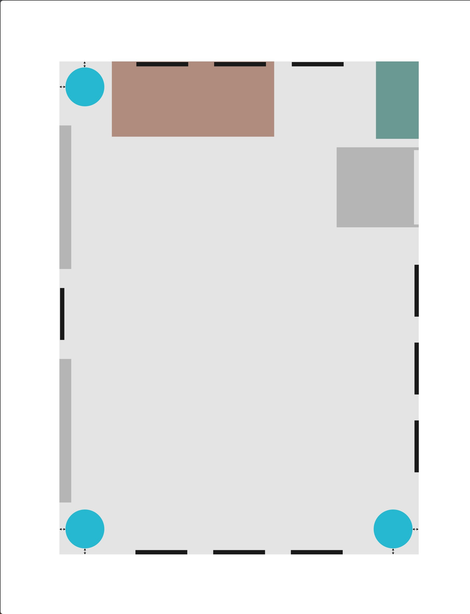
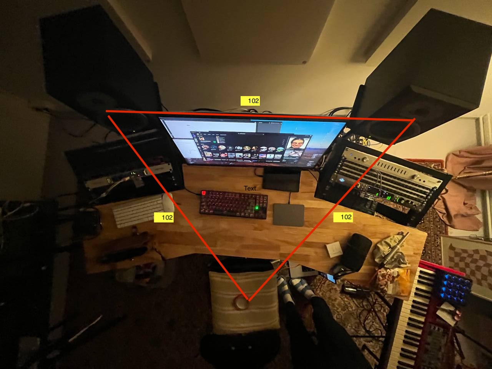
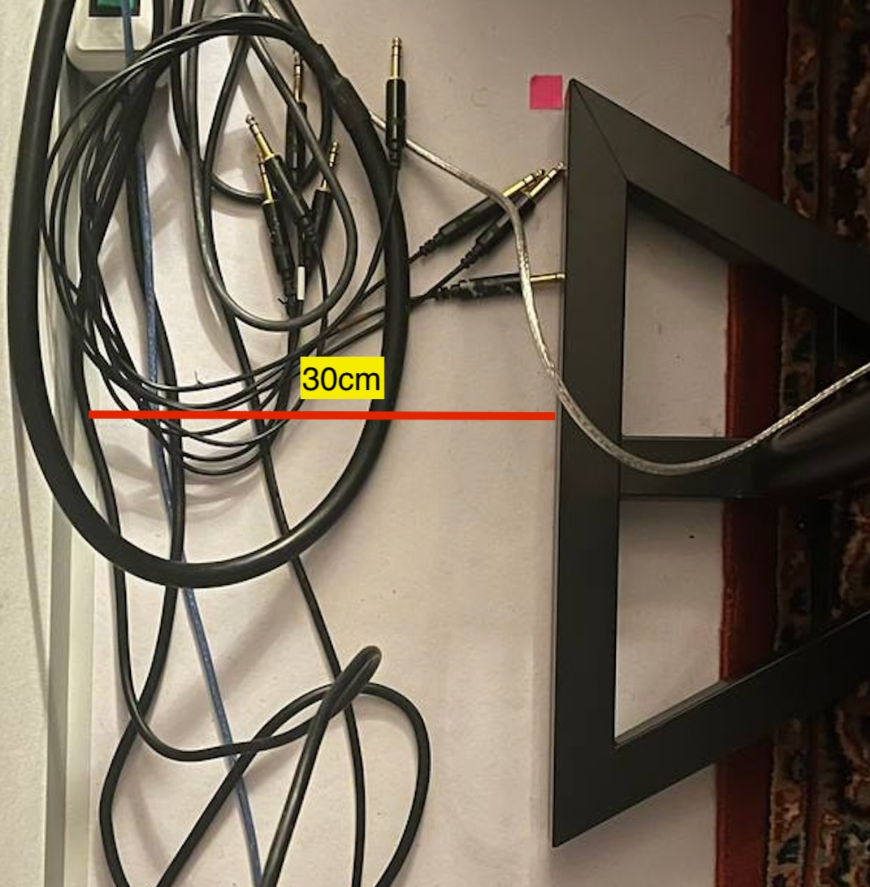
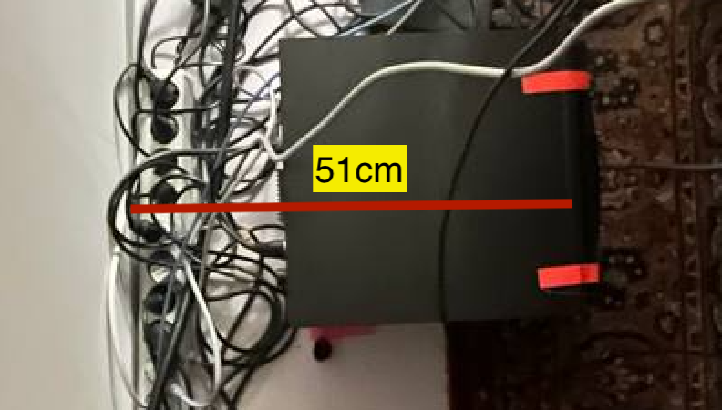
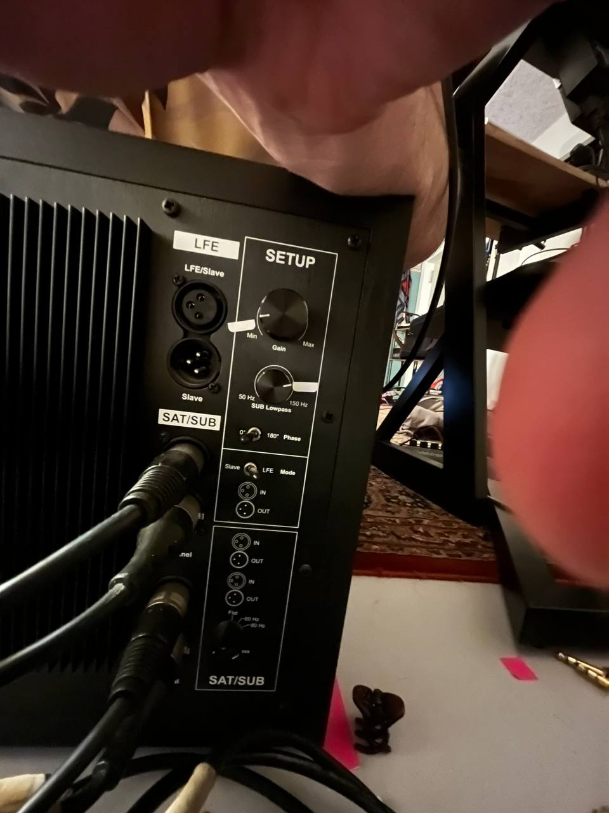
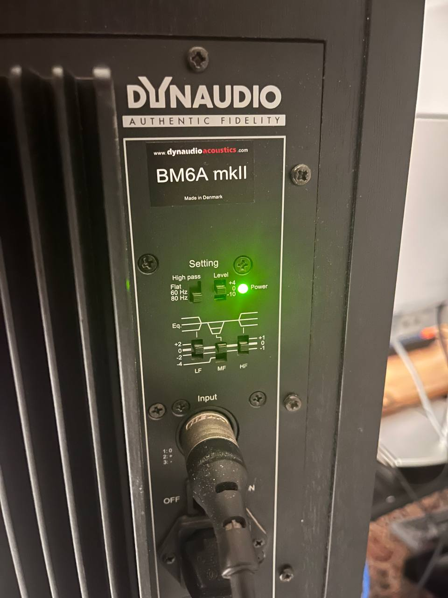
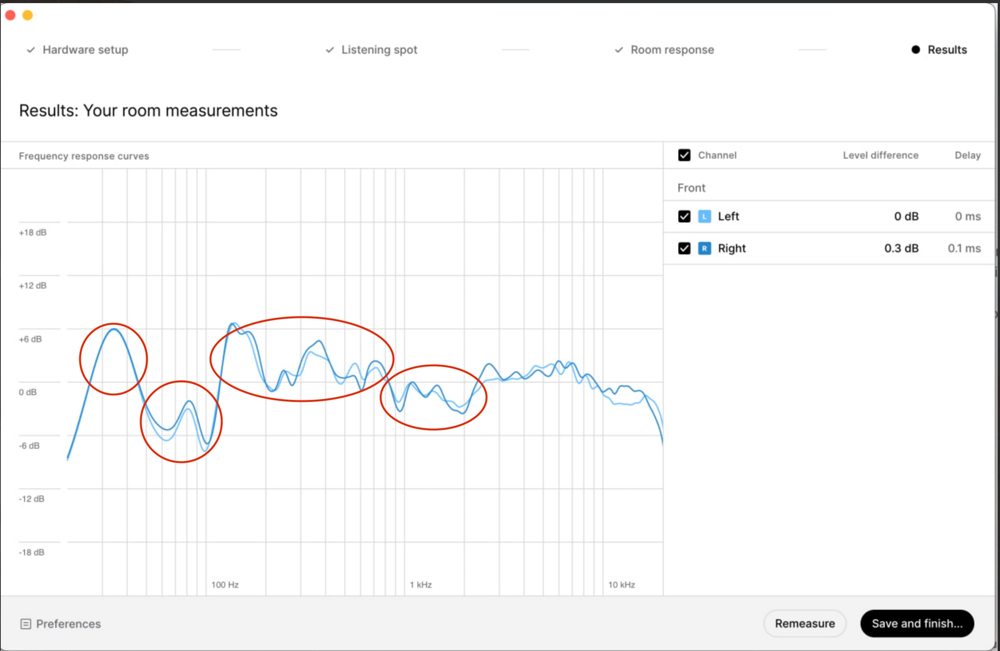
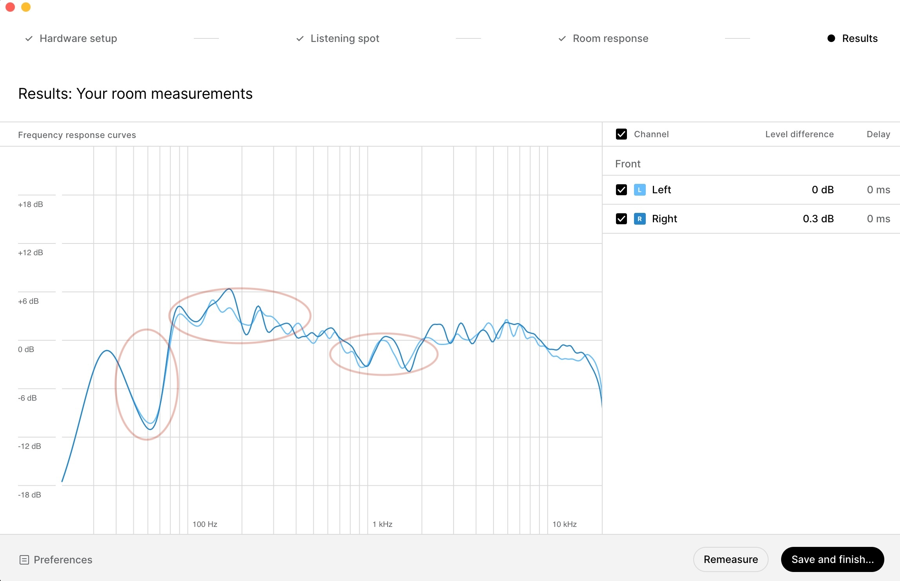
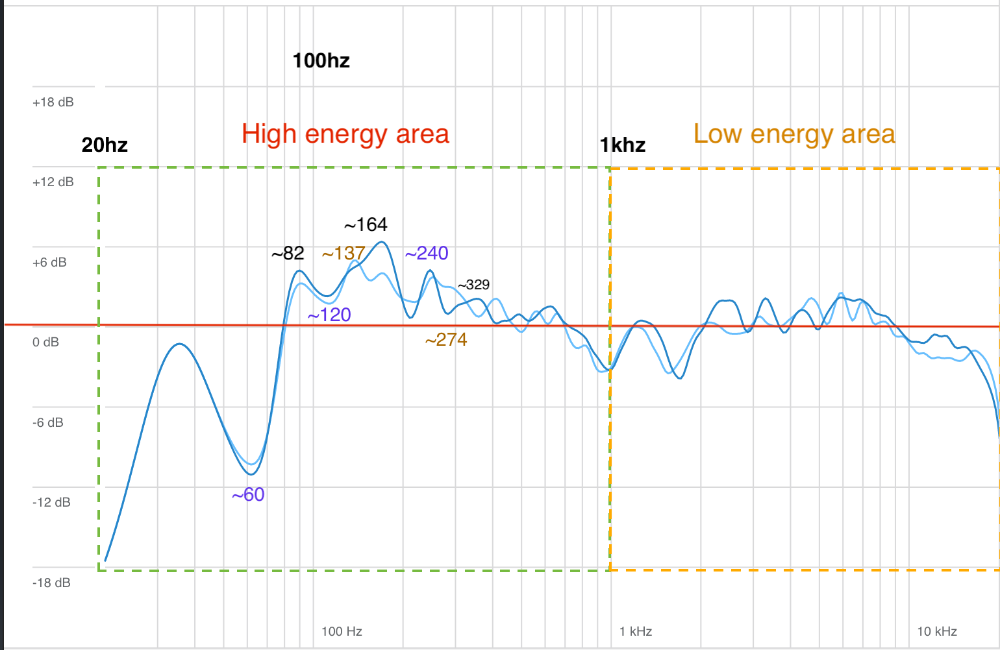

# Post wall absorber measurements, monitor placement and sub woofer calibration

## Absorber hanging session

The session went very well and [absorbers](https://www.thomann.de/intl/t.akustik_pet_wall_absorber_120_wh.htm) are hanged.

10 absorbers are hanged on the wall at relevant places.

The plan in the following document is followed:



> In the resources folder of this repository you can find the original plan in .pdf and .ai format to obtain measurements.

In addition to the placement decisions which can be observed in the document above, the following measurements are taken:

- For all the walls other than the desk wall, the absorbers are hanged at **90 cm** from the floor.
- For the desk wall, the absorbers are hanged at **78 cm** from the floor. This is due to the studio monitor height.

### Observations after the absorber hanging session

- In the places where absorbers cover, the recursive echo is eliminated, and the room sounds more controlled.
- In corner to corner symmetries a mild echo is still present due to the absence of bass traps.
- Absorbers blend in to the room visually and do not disturb the overall look of the room.
- I didn't yet spot any case where the absorbers are in the way of the workflow.
- The desk is moved in 5cm extra from the wall to create a gap for the absorbers and have a healthy gap between the back of the studio monitors and the wall.

## Studio Monitor Placement

Until today the studio monitors were placed temporarily and arbitrarily on the desk.

Today, some actions are taken to suggest a permanent placement:

### Stands

With some decent amount of troubleshooting to understand why the studio monitor stands are not the same height, we've come to the conclusion that the floor is not perfectly leveled.

✅ To mitigate this issue, the left speaker stand is heightened enough to level with the right speaker stand.

### Placement of the upper speakers

It is a widely accepted convention to form an equilateral triangle between the listener and the studio monitors.

Following this convention, the studio monitors are placed at a distance of **102 cm** from each other and **102 cm** from the listening spot.

The following image (crudely) also illustrates the placement:



> Note that this image does not reflect the actual distances, it is just a visual representation.
> The actual distances are measured in detail multiple times.

The location between studio monitor mid code and tweeters could be aligned with the ear level by adjusting the height of the chair depending on your height.

The studio monitor mid cones are **51cm** away from the wall.
This is relevant to the sub woofer placement and calibration.

The studio monitor stands are set to be **30cm** away from the wall.



### Sub Woofer Placement

For the sub woofer placement and [calibration](#studio-monitor-calibration), I don't have prior experience also, due to this I've depended on the following resources:

- <https://www.prosoundweb.com/in-the-studio-three-steps-to-adding-a-subwoofer/>
- <https://www.youtube.com/watch?v=HtE9qNV9zj8>

Since the sub woofer is a third speaker in the system, it needs to be vertically aligned with the studio monitors to mitigate phase cancellation issues. Even though our sub woofer has a phase switch, it switches between 0 and 180 degrees. It is easier to find the correct spot for the sub woofer than to find the correct phase setting since the phase setting is a binary option.

The sub woofer's cone is placed at **51cm** away from the wall, aligned with the studio monitor mid cones which are also **51cm** away from the wall.

The end of the pink tape also shows the right place for the sub woofer:



## Studio Monitor Calibration

The resources in the upper section is also used for the calibration of the studio monitors against the sub woofer.

For calibration the following pink noise sample is used:

- <https://www.youtube.com/watch?v=8SHf6wmX5MU>

The pink noise sample was played at full volume from youtube and the output of Apollo x8p was set to **-25db**.
This results in **84 to 85 dbSPL** from each of our studio monitors measured with a professional SPL meter app.
The metering setting of the SPL meter app is set to **C** weighting and **Slow** response.

Our studio monitors does not have a built in volume control so finding the right spot on Apollo x8p was sufficient.

Getting this as a reference, the sub woofer volume is calibrated to produce **80 dbSPL** when the upper monitors are turned off.

The place for the sub woofer volume knob is marked with a white tape which is shown in the end of this section.

### Sub woofer and studio monitor crossover frequency setting

The crossover frequency of the sub woofer is set to **80 Hz**.
Upper speaker crossover frequency is set to **80 Hz** as well.

I've decided on **80hz** to give as much headroom to the upper speakers for clarity but we can experiment with this setting in the future.

Setting the upper speaker crossover frequency to **80 Hz** is easy because it is done with a switch.

On the other hand setting the sub woofer crossover frequency is a bit tricky. The sub woofer has a knob for this setting.
I've sent a pure **80 Hz** sine wave to the sub woofer, set the knob to **150hz**, start measuring the SPL then started to decrease the frequency until the point where the initial SPL measurement starts to drop.

This way we can find the correct spot for the sub woofer crossover frequency for **80 Hz**.

This point is marked with a white tape on the sub woofer crossover knob.

### Markings

The markings could be used as a reference point for future adjustments or for people who'd like to experiment but then return to the calibrated settings.

The following images show the markings and settings:




## Latest room measurements and thoughts

After the upper steps are taken, the room is measured with [Sonarworks](https://www.sonarworks.com/soundid-reference) once more.

The following section will encapsulate my thoughts about the measurements, comparisons and possible future steps.

The first image shows the pre-absorber, arbitrary placed speaker measurements:



The second image shows the post absorber, calibrated speaker measurements:



Apparently there were some improvements but there is also a lot of room for improvement! Many of the dramatic peaks and valleys happen because we don't yet have a controlled bass in the room. This is expected since we don't have bass traps yet.

Here is the detailed analysis:

We have **416cm** x **570cm** x **250cm** room dimensions.
Which will result in **82.452hz**, **60.1754hz** and **137.2hz** room modes.

The octaves of those fundamentals below **~300hz** (because the wall absorbers would absorb them) are

```text
82.452 => 164.904, 329.808

60.1754 => 120.3508, 240.70

137.2 => 274.4
```

As you see the problematic parts match roughly to the room modes (standing waves).
Problematic means dramatic valleys or peaks in this context.
Depending on the listening spot these problems show themselves either like valleys or peaks.

From the 1k mark the shape repeats itself roughly.



I expect that decent amount of bass absorbing in the room will flatten the curve and make the room sound more controlled.
Because when the energy of the reflections are reduced (for the bass waves) we expect to have less phase issues in the listening spot, the valleys move up an amount and the peaks move down an amount to have a more controlled sound.

We can not reach a perfect flat curve since the room is not an anechoic chamber but we can have a more controlled sound.

After the bass traps we can introduce some amount of [Sonarworks](https://www.sonarworks.com/soundid-reference) to the equation to control the room even more.

At that point I believe that we'd reach our sweet spot ✨
