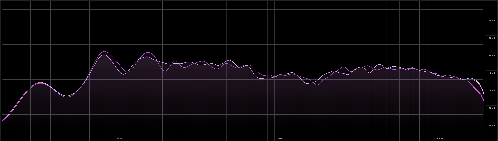

# Studio Room Layout changes / Improvements and Regressions

## Changes

In this session the studio layout has been reversed with the following changes:

- The desk is moved to the opposite wall facing the further wall from the door in a way where the listening spot is in around %38 - %45 of the room length. (Advice from the GIK free acoustic advice service has been followed.)
- Drum sets are moved to the further wall from the door.
- The space in the back of the desk is more accessible and also hosts storage, cable drawers and things alike.
- Vacuum cleaning is done.
- The couch has been moved to the side wall.
- Little amp is moved to the further wall from the door and VOX stayed in its place now also accompanied with Ibiza.
- Side tables or stands adjacent to the desk stayed.
- I've bought 3-4 more plug sockets and placed them in key places so we are not out of sockets anymore.

### Details about the operation

- The connections of the gear is only disconnected as minimal as possible to move big pieces.
- All disconnected cables are properly tidied up and placed near its place.
- Woofer is re-calibrated.
- Room is re-measured.
- Due to the problem with the single Dynaudio BM6A tweeter, Adam A3 monitors are placed as the upper speakers.
- The plant is in the middle of the room. One needs to put it out to use the studio with optimal conditions and then put it back in. On the other hand I think it might be nice to maybe swap that plant with a smaller one since it has grown too big.

### Lighting

- Big light is removed since it was occupying too much space.
- Small point lights are introduced also with a desk light.

> We shouldn't consider lighting as "done" but we can improve it over time. It is just that the huge light didn't work in my opinion since space is more important.

## New Layout Improvements

- The listening spot is now in a better position in the room. It is in the %38 - %45 of the room length. This is a better position for the listening spot according to the GIK free acoustic advice service and improved the listening experience.
- The door and the dead area (square) in the entrance is not stealing from our usable space anymore. It seems that we have gained a square meter or two in the room in our usable space.
- Drum sets are on the big rug so when playing they do not suffer from sliding in the floor and stay intact.
- The categories in the room is better organized. Guitar stands, cable drawers, storage closet, shelves, etc. are in one part of the room and musical instruments and playing area is in the other part.
- Back of the desk is accessible which is good for tidying up, cleaning, changing connections etc.
- The storage closet is more accessible and guitars are out of the way.
- More open area for Daniel's corner with the organelle, Vox and the mic.

## New Layout Regressions / Tradeoffs

- The couch located in the side wall is not as comfortable as the previous location 1/3 of it is a bit too close to the keyboard rig now. On the other hand one gets used to it easily. Also it does not face the speakers now so directly sitting there and listening to the music is not as optimal as before.
- The entrance to the studio is a bit more narrow now. This is not a big problem but it is a tradeoff so it is listed here.

## Measurements

### After layout changes:

### Before layout changes:

### Thoughts

I've realized in this new location some problems introduced by the room is reduced and some became more visible and narrowly located so understanding the problems and the ways of treating them became more clear. I see this as an improvement. Also I think the sound became a little bit more sweeter.

I've also asked Claude Sonnet 3.5 to compare the measurements and he also confirmed that the new measurements are better with similar thoughts.

Asking for improvements later also produced a sensible answer:

We can approach this step by step in time but I think with the current state it is close to workable with the Sonar Works room correction and also A / B comparisons with good headphones.
id code and tweeters could be aligned with the ear level by adjusting the height of the chair depending on your height.

## Photos from the new layout

### General look

### Informative photos

> All the cables which was once connected to this snake has been tidied up and placed near its place.

> The problematic speaker is marked with a red polka dot and both are stored safely over the storage closet.

