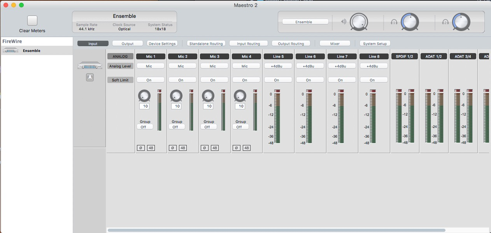
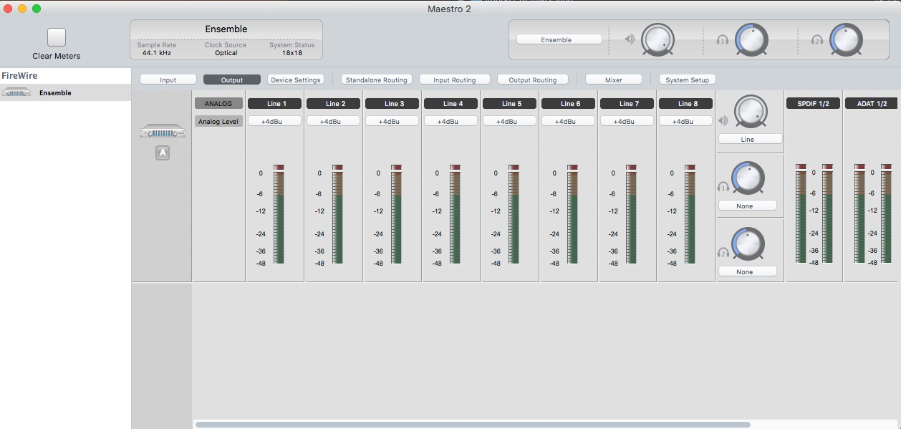
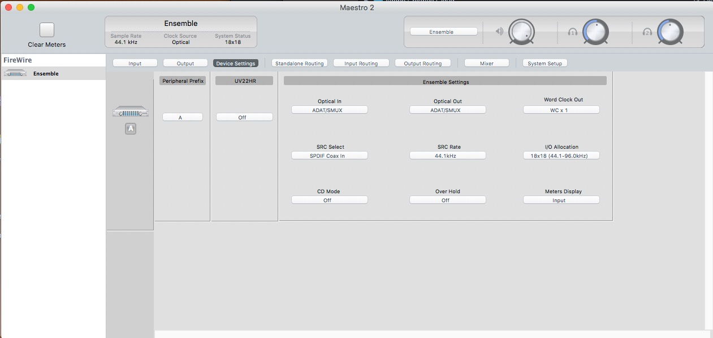
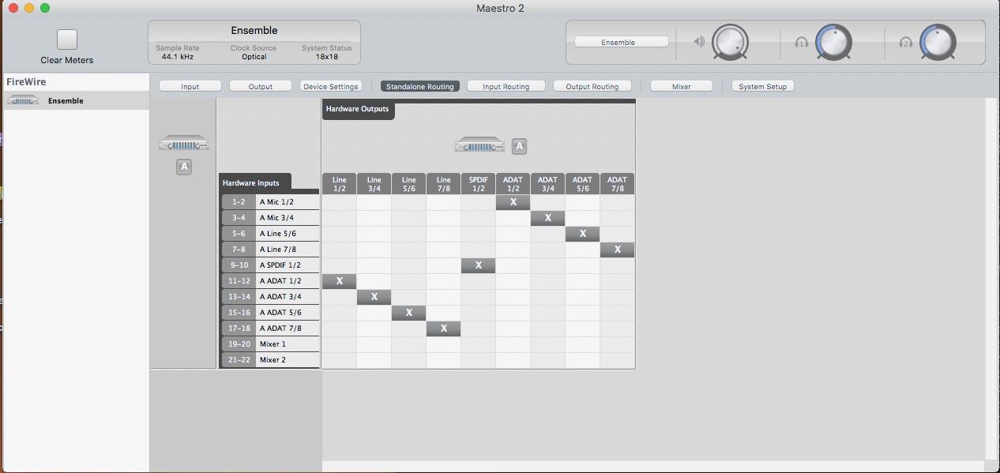
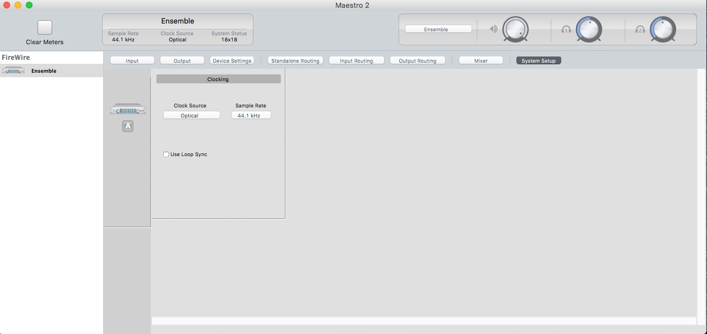
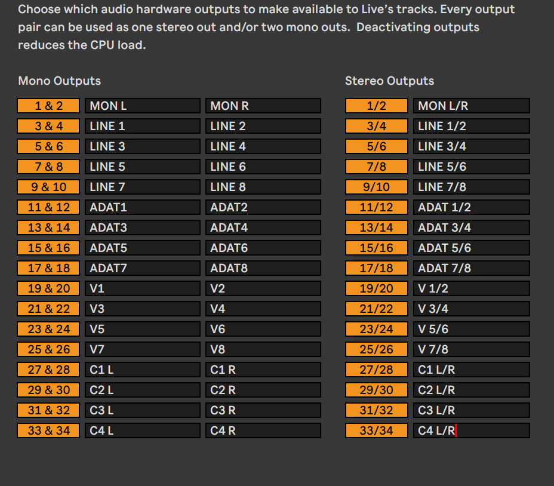

# Signal Flow / Routing / Patch bay

This document denotes our signal flow and routing. It will be continuously updated to stay in sync with real world changes.

## What is a patch bay?

On the right side of the table there are two `NYS-SPP-L1` patch bays which consumes in total `2U` space.
They're placed there for easy, convenient and quick routing for signals. They allow for complex routing to be applied without the need to reach any equipment's back panels.

In short words a patch bay is an interface to connected signal routes to enable routing them with flexibility in a single place.

The internal connection between the front sockets and the rear sockets of a patch bay, by standard can be configured 3 different ways.

- Normalized
- Half normalized
- De-normalized / Isolated (Thru)

If you wish to know about the upper two you may read it in the internet.

On the other hand our patch bay is configured as **De-normalized**.
This configuration **directly connects the front socket to the corresponding rear socket**.

```
Front Socket 1  <--> Rear Socket 1
Front Socket 2  <--> Rear Socket 2
Front Socket 3  <--> Rear Socket 3
etc..
```

## Our patch bays and physical routing

Each installed patch bay,

- Includes `48` sockets in it's front face and `48` sockets in it's back.
- Has `2` rows each containing `24` sockets, the top row is labeled `A` and the bottom row is labeled `B`.

From here on I'll refer the rows for the top patch bay as `A1` and `B1` for the bottom one `A2` and `B2`.

### `A1`

```
1  | AIN1 <--> Apollo Line In 1
2  | AIN2 <--> Apollo Line In 2
3  | AIN3 <--> Apollo Line In 3
4  | AIN4 <--> Apollo Line In 4
5  | AIN5 <--> Apollo Line In 5
6  | AIN6 <--> Apollo Line In 6
7  | AIN7 <--> Apollo Line In 7
8  | AIN8 <--> Apollo Line In 8
9  | TML <--> MT2X Master Out L
10 | TMR <--> MT2X Master Out R
11 | T1 <--> MT2X Channel 1 Out
12 | T2 <--> MT2X Channel 2 Out
13 | T3 <--> MT2X Channel 3 Out
14 | T4 <--> MT2X Channel 4 Out
15 | MINIST.L <--> Mini Stereo Jack L
16 | MINIST.R <--> Mini Stereo Jack R
17 | EIN8 <--> Ensemble Line In 8
18 | EIN7 <--> Ensemble Line In 7
19 | EIN6 <--> Ensemble Line In 6
20 | EIN5 <--> Ensemble Line In 5
21 | EIN4 <--> Ensemble MIC/HI/Z In 4
22 | EIN3 <--> Ensemble MIC/HI/Z In 3
23 | FREE
24 | FREE
```

#### Notes

- `A1` includes most of our audio interface inputs and some other connections.
- `MT2X` is the 4 track tape located on the bottom row on the right side of the table.
- Mini stereo jack is currently not connected but will be connected soon. This is mostly for connecting field recorders, phones, walkmans or that sort of equipment.
- Currently `MT2X` is not in its best shape so I'd ask not to use it. I'll soon maintain it and it will be open for use.
- In my next visit I'll also correct Ensemble standalone internal routing but the connections in the patch bay will not be effected.
- Maybe you've realized that `EIN1` and `EIN2` are missing in the list. This is because they're easily accessible from the front of the audio interface as `HI/Z 1` and `HI/Z 2` thus do not need a place in the patch bay for easy access.

### `B1`

```
1  | AOUT1 <--> Apollo Line Out 1
2  | AOUT2 <--> Apollo Line Out 2
3  | AOUT3 <--> Apollo Line Out 3
4  | AOUT4 <--> Apollo Line Out 4
5  | AOUT5 <--> Apollo Line Out 5
6  | AOUT6 <--> Apollo Line Out 6
7  | AOUT7 <--> Apollo Line Out 7
8  | AOUT8 <--> Apollo Line Out 8
9  | BD <--> * Multicore out floating
10 | SD <--> * Multicore out floating
11 | RS/CP <--> * Multicore out floating
12 | BT <--> * Multicore out floating
13 | LT <--> * Multicore out floating
14 | MT/HT <--> * Multicore out floating
15 | CH/OH <--> * Multicore out floating
16 | CY/CB <--> * Multicore out floating
17 | EOUT8 <--> Ensemble Line Out 8
18 | EOUT7 <--> Ensemble Line Out 7
19 | EOUT6 <--> Ensemble Line Out 6
20 | EOUT5 <--> Ensemble Line Out 5
21 | EOUT4 <--> Ensemble Line Out 4
22 | EOUT3 <--> Ensemble Line Out 3
23 | EOUT2 <--> Ensemble Line Out 2
24 | EOUT1 <--> Ensemble Line Out 1
```

#### Notes

- `B1` includes most of our audio interface outputs and some other connections.
- Sockets `9..=16` are reserved for Elektron Analog Rytm direct outs. Since you also have one, if you'd like to record the direct outs through the patch bay but not overbridge you may use these sockets. They end up with a multicore cable currently not connected close to Mehmet's table, it is hard to miss.

### `A2`

```
1  | FREE
2  | FREE
3  | PORTICO IN HI/Z <--> Portico Instrument In
4  | FREE
5  | FREE
6  | FREE
7  | FREE
8  | BROKEN DO NOT USE
9  | KORGIN <--> Korg Minilogue Input (Not permanently connected/Reserved)
10 | ELEKIN L <--> Elektron Analog Rytm In L (Not permanently connected/Reserved)
11 | ELEKIN R <--> Elektron Analog Rytm In R (Not permanently connected/Reserved)
12 | FREE
13 | FREE
14 | FREE
15 | FREE
16 | FREE
17 | REVSEND <--> FX1 SEND (Not permanently connected/Reserved)
18 | DELSEND <--> FX2 SEND (Not permanently connected/Reserved)
19 | NOT LABELED <--> FX3 SEND (Not permanently connected/Reserved)
20 | NOT LABELED <--> MT2X Channel 1 In
21 | FREE
22 | FREE
23 | FREE
24 | FREE
```

#### Notes

- Portico is the Neve preamp which has blue and red colors placed under the tape.
- Sockets `17..=19` are reserved for external effect sends. The cables are actually connected in the back but currently floating. You may follow them. `REVSEND` and `DELSEND` are old labelings and will be updated.
- `NOT LABELED` places will be labeled once I'm sure, probably soon.

### `B2`

```
1  | FREE
2  | FREE
3  | FREE
4  | FREE
5  | FREE
6  | FREE
7  | PORTICO MIC OUT <--> Portico Mic Out
8  | PORTICO LINE OUT <--> Portico Line Out
9  | KORGOUT <--> Korg Minilogue Mono Output (Not permanently connected/Reserved)
10 | ELEKM L <--> Elektron Analog Rytm Main Out L (Not permanently connected/Reserved)
11 | ELEKM R <--> Elektron Analog Rytm Main Out R (Not permanently connected/Reserved)
12 | FREE
13 | FREE
14 | FREE
15 | FREE
16 | FREE
17 | REVRET <--> FX1 RETURN (Not permanently connected/Reserved)
18 | DELRET <--> FX2 RETURN (Not permanently connected/Reserved)
19 | NOT LABELED <--> FX3 RETURN (Not permanently connected/Reserved)
20 | NOT LABELED <--> MT2X Channel 2 In
21 | FREE
22 | FREE
23 | FREE
24 | FREE
```

#### Notes

- Portico is the Neve preamp which has blue and red colors placed under the tape.
- Sockets `17..=19` are reserved for external effect returns. The cables are actually connected in the back but currently floating. You may follow them. `REVRET` and `DELRET` are old labelings and will be updated.
- `NOT LABELED` places will be labeled once I'm sure, probably soon.

## ADAT and notes about Apogee Ensemble

ADAT is a protocol to transfer digital audio signals through optical connections.
We also have ADAT setup between Apollo x8p and Apogee Ensemble.

```
Apollo ADAT Out --> Ensemble ADAT In
Ensemble ADAT out --> Apollo ADAT In
```

ADAT does not mean anything alone because it depends on internal routing of the audio interfaces.

Let's start from the simple one:

```
Ensemble ADAT out --> Apollo ADAT In
```

is routed in a way which

```
Ensemble (Physical) MIC/HI/Z IN 1 --> Apollo ADAT IN 1 (IN 9)
Ensemble (Physical) MIC/HI/Z IN 2 --> Apollo ADAT IN 2 (IN 10)
Ensemble (Physical) MIC/HI/Z IN 3 --> Apollo ADAT IN 3 (IN 11)
Ensemble (Physical) MIC/HI/Z IN 4 --> Apollo ADAT IN 4 (IN 12)
Ensemble (Physical) LINE IN 5 --> Apollo ADAT IN 5 (IN 13)
Ensemble (Physical) LINE IN 6 --> Apollo ADAT IN 6 (IN 14)
Ensemble (Physical) LINE IN 7 --> Apollo ADAT IN 7 (IN 15)
Ensemble (Physical) LINE IN 8 --> Apollo ADAT IN 8 (IN 16)
```

For example if you connect a signal to Ensemble (Physical) LINE IN 8 (A1 Socket 17) you'll see that signal in Input 16 (Apollo ADAT IN 8) in Apollo Console application.

This routing enables us to extend `8` physical inputs to Apollo to `16` using Ensemble physical inputs.

Now let's talk about the other way:

```
Apollo ADAT Out --> Ensemble ADAT In
```

is routed in a way which

```
Apollo ADAT OUT 1 --> Ensemble (Physical) LINE OUT 1
Apollo ADAT OUT 2 --> Ensemble (Physical) LINE OUT 2
Apollo ADAT OUT 3 --> Ensemble (Physical) LINE OUT 3
Apollo ADAT OUT 4 --> Ensemble (Physical) LINE OUT 4
Apollo ADAT OUT 5 --> Ensemble (Physical) LINE OUT 5
Apollo ADAT OUT 6 --> Ensemble (Physical) LINE OUT 6
Apollo ADAT OUT 7 --> Ensemble (Physical) LINE OUT 7
Apollo ADAT OUT 8 --> Ensemble (Physical) LINE OUT 8
```

For example a signal you've generated from your DAW and sent it to Apollo ADAT OUT 1 will appear on the patch bay B1 socket 24 (Ensemble LINE OUT 1),

This enables for us to extend our output count `10` to `18` which gives us more patching capabilities using outboard, external effects etc.

## Snake / Multicore

There is a `8` XLR input multi core in the right side of the table. It is connected to the Apollo x8p's mic inputs `1..=8`.

## Unconnected cables on the coming out from the patch bay / free slots

Many of the unconnected cables coming out from the backside of the patch bay have color coding or labels on them. If anything is unclear don't hesitate to ask.

Please use the free slots as you wish if you need them.

## Extra outputs

Both Apollo and Ensemble have 2 headphones outputs on their front faces each.
For Apollo, please consult the user manual and learn the console application if you'd like to take advantage of them.

For Ensemble please keep on reading the next section.

## The current state of Ensemble and the stand alone mode

Apogee Ensemble Firewire is a discontinued product but it has top notch converters and is a professional audio interface for its time.

The downside is that it is not working with the latest mac os anymore due to Apple dropping Firewire support from CoreAudio. The only way to configure the audio interface is to use an older version of mac os. I own an old computer which can accomplish this.

The standalone mode mitigates this situation partially. Because we can configure a routing in the interface and use it without connecting it to a computer, also we can control some functions from the front facing panel.

- Setting output levels for two headphone outputs and the main outputs.
- Setting input levels for 4 preamps configured as `mic`.
- Turn device on and off.
- The meters are configured to show input signals.

It is important that ensemble output volume is always in full position because then it is transparent. Digital audio interfaces usually work by attenuation but not amplification. So volume at 0db means signal is not attenuated digitally.

Ensemble has also 4 mic (XLR) inputs in the back side, which are not connected at the moment. All 4 preamps are configured as `mic` at the moment and input gains can be controlled. The other 4 inputs are line level (+4dBu) inputs with no preamps.

To learn more about the standalone mode of Apogee Ensemble you may search relevant keywords, watch videos or read the manual.

The following images shows the current state of the Apogee Ensemble in standalone mode:

### Input Config



### Output Config



### Device Settings



### Routing



### System Setup



## Advices about Ableton or any other DAW setup

With all these out of the way I'd like to share my Ableton I/O labeling with you.

It may be useful to you also.



This is basically following the routing in the Apollo Console.
For the inputs I'm using the same scheme following exactly how Apollo labels them.

This helps with the consistency and ease of use.

I'd also like to share my default template project with you,
if it makes sense to you and want to use it feel free to ask it in the telegram group.

In the template project I/O labelings are included and audio tracks are created for all 16 inputs of Apollo and Ensemble.
